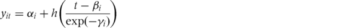

```{r setup, include=FALSE}
knitr::opts_chunk$set(echo = TRUE)
```

```{r}
suppressMessages(library(readxl))
suppressMessages(library(plotly))
suppressMessages(library(randomForest))
suppressMessages(library(dplyr))
suppressMessages(library(GGally))
suppressMessages(library(ggplot2))
suppressMessages(library(scatterplot3d))
suppressMessages(library(sitar))
```

## Clean Data:
  1. Read the data from excel file.
  2. Deleted the data that the height is NA.
  3. Renamed the column name.
  
```{r}
dat_ex_all <- read_excel("./SharedFiles/ST606/2020/data/Exercise/fit_database_anthropometric_all.xlsx", sheet=1, na='NA')

# Clean data (delete all data that the follow conditions are NA)
dat <- subset(dat_ex_all, `height (cm)` != 'NA')
# Change the date to year
dat$mYear <- substr(as.character(dat$`measurement date`), start=1, stop=4)

# Change the colnames
colnames(dat)[10] <- 'z_category'
colnames(dat)[9] <- 'z_score'
colnames(dat)[2] <- 'm_date'
colnames(dat)[3] <- 'age'
colnames(dat)[4] <- 'age_bin'
colnames(dat)[6] <- 'height'
colnames(dat)[7] <- 'weight'

dat$ID = as.character(dat$ID)

# check the deleted data
dataSta <- data.frame(All = nrow(dat_ex_all), Object = nrow(dat), Deleted = nrow(dat_ex_all) - nrow(dat)) 
dataSta
```

## Background:
The growth curve analysis is a statistical issue in life course. 
Height in puberty involves a growth spurt, the timing and intensity of which varies between individuals.

## Methods:
I used the SuperImposition by Translation And Rotation (SITAR) model, a shape invariant model with a single fitted curve. Curves for individuals are matched to the mean curve by shifting their curve up–down (representing differences in mean size) and left–right (for differences in growth tempo), and the age scale is also shrunk or stretched to indicate how fast time passes in the individual (i.e. velocity). 
These three parameters per individual are estimated as random effects while fitting the curve. 
The outcome is a mean curve plus triplets of parameters per individual (size, tempo and velocity) that summarize the individual growth patterns.

## DataSets:
The data are heights for boy(31) and girl(38) at the stage between 2007 and 2018,
and have the complete set of 22 observations between the ages of 6 and 18 years.

## The first dataset:
  The 31 boys who has the complete set of 22 observations.
```{r}
# The boy who has the complete set of 22 observations
data_f_boys <- filter(dat, gender=="boy")
boyID <- data_f_boys %>% group_by(ID) %>% 
  summarise(nid = n())  %>% filter(nid == 22) %>% pull(ID)
data_f_boys <- filter(data_f_boys, ID %in% boyID)
ggplot(data_f_boys, aes(x=age, y=height, color=ID))  + geom_line() + facet_wrap(~ID)
ggplot(data_f_boys, aes(x=age, y=height, color=ID)) + geom_line()
```

## The SITAR model:
The method used to summarize the individual growth curves.
This is a shape invariant model that involves fitting the following random effects model to the set of height growth curves.


where yit is height for subject i at age t, h(t) is a natural cubic spline curve of height vs age, 
and αi, βi and γi are subject-specific random effects. 
The aim is to choose the values of αi, βi and γi to make the individual growth curves as similar as possible.

  1. αi is a random height intercept that adjusts for differences in mean height—here it is termed size.
  Geometrically it can be thought of as a subject-specific shift up or down or translation in the spline curve, with αi smaller for shorter children.
  
  2. βi is a random age intercept to adjust for differences in the timing of the pubertal growth spurt in individuals, and it is here called tempo.
  Geometrically it corresponds to a subject-specific left–right shift or translation in the spline curve, with βi negative for early puberty and positive for late.
  
  3. γi is a random age scaling that adjusts for the duration of the growth spurt in individuals. Its parameterization as exp(–γi) ensures that both positive and negative values are permissible, with zero corresponding to average velocity, and the minus sign means that it measures velocity rather than its inverse.
  Geometrically it corresponds to a shrinking or stretching of the age scale. Thus for a child with a relatively short spurt and a steep growth curve, γi is positive to stretch the age scale and reduce the slope (i.e. peak velocity). Conversely, if γi is negative the age scale is shrunk and the curve slope increased. For this reason the parameter is termed velocity.

## Find the best the degrees of freedom (By BIC) before fit the model
   The degrees of freedom (DF) indicate the number of independent values 
   that can vary in an analysis without breaking any constraints.

```{r}
## find the best degree freedom
bestDf <- dfset(x = age, y = height, data = data_f_boys, FUN = BIC, df = 1:10, plot = TRUE)
```

When Df = 4, the BIC is the lowest, choose the df = 4 for fitting model

## Fit boy's data height versus age (df = 4)
   Draw fitted distance and velocity curves

```{r}
## The growth curve for boy's height
fitHB <- sitar(x = age, y = height, id = ID, data = data_f_boys, df= bestDf[1])

#Options: 
# ’d’:fitted Distance curve
# ’v’:fitted Velocity curve
# ’e’:fitted fixed Effects distance curve
# ’D’:individual fitted Distance curves
# ’V’:individual fitted Velocity curves
# ’u’:Unadjusted individual growth curves
# ’a’:Adjusted individual growth curves

## draw fitted distance and velocity curves with velocity curve in blue
plot(fitHB, y2par=list(col='blue'), apv=TRUE)
```

The distance curve(solid black line) (left y axis) indicates the amount of height achieved at a given age.

The velocity curve(dashed blue line) (right y axis) indicates the rate of growth at a given age.

1. The growth rate:
   The boys grow fast between 6~15 year-old, grow slowly after 15 year-old.
   
2. The growth velocity:
   a) It reached the peak of 9.685 at the age of 13.42.
   b) It is relatively constant between 6~9 year-old.
   c) It declined slowly between 9~11 year-old.
   d) It increased rapidly between 11~13.42 year-old.
   e) It declined rapidly between 13.42~17 year-old.
   f) It is relatively constant after 17 year-old.

```{r}
## fit sitar model for height
mb1 <- sitar(x=age, y=height, id=ID, data=data_f_boys, df=bestDf[1])

summary(mb1) 

```

The model(Age versus Heght) has the lowest BIC, choose the model.

```{r}
mplot(x = age, y = height, id = ID, data = data_f_boys, col = ID, las = 1)
plot(mb1, opt = 'a', col = ID, las = 1, xlim = xaxsd(), ylim = yaxsd())
```

## The second dataset:
  The 38 girls who has the complete set of 22 observations.
  
```{r}
# The girl who has the complete set of 22 observations
data_f_girl <- filter(dat, gender=="girl")
# The girl who has 22 records
girlID <- data_f_girl %>% group_by(ID) %>% 
  summarise(nid = n())  %>% filter(nid == 22) %>% pull(ID)
data_f_girl <- filter(data_f_girl, ID %in% girlID)

ggplot(data_f_girl, aes(x=age, y=height, color=ID))  + geom_line() + facet_wrap(~ID)
ggplot(data_f_girl, aes(x=age, y=height, color=ID)) + geom_line()
```

```{r}
########################################################
## Growth Curve Analysis (Height)
##
## fit the Height growth curve analysis(Girl)  
########################################################


ggplot(data_f_girl, aes(x=age, y=height, color=ID)) + geom_point() + geom_smooth(formula = "y~x", method = "loess", se=FALSE) + facet_wrap(~ID)


bestDf <- dfset(x = age, y = height, data = data_f_boys, FUN = BIC, df = 1:10, plot = TRUE)

## The growth curve for girl's height
fitHG <- sitar(x = age, y = height, id = ID, data = data_f_girl, df=bestDf[1], control = nlmeControl(msMaxIter = 500, maxIter = 1000, returnObject = TRUE))

mplot(x = age_bin, y = height, id = ID, data = data_f_girl, col = ID, las = 1)
plot(fitHG, opt = 'a', col = ID, las = 1, xlim = xaxsd(), ylim = yaxsd())
```

The graph shows the Height growth curve analysis(Girl).

  The height has two steps: 6-13 year-old grows fast, 14-18 year-old grows slowly.


```{r}


```