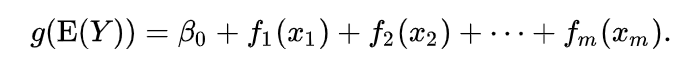

```{r setup, include=FALSE}
knitr::opts_chunk$set(echo = TRUE)
```

```{r}
suppressMessages(library(plotly))
suppressMessages(library(dplyr))
suppressMessages(library(GGally))
suppressMessages(library(scatterplot3d))

suppressMessages(library(readxl))
suppressMessages(library(ggplot2))
suppressMessages(library(mgcv))
suppressMessages(library(itsadug))
```

## Clean Data:
  1. Read the data from excel file.
  2. Deleted the data that the weight is NA.
  3. Renamed the column name.
  
```{r}
dat_ex_all <- read_excel("./SharedFiles/ST606/2020/data/Exercise/fit_database_anthropometric_all.xlsx", sheet=1, na='NA')

# Clean data (delete all data that the follow conditions are NA)
dat <- subset(dat_ex_all, `weight (kg)` != 'NA')
# Change the date to year
dat$mYear <- substr(as.character(dat$`measurement date`), start=1, stop=4)

# Change the colnames
colnames(dat)[10] <- 'z_category'
colnames(dat)[9] <- 'z_score'
colnames(dat)[2] <- 'm_date'
colnames(dat)[3] <- 'age'
colnames(dat)[4] <- 'age_bin'
colnames(dat)[6] <- 'height'
colnames(dat)[7] <- 'weight'

dat$ID = as.factor(dat$ID)

# check the deleted data
dataSta <- data.frame(All = nrow(dat_ex_all), Object = nrow(dat), Deleted = nrow(dat_ex_all) - nrow(dat)) 
dataSta
```

## Background:
The analysis is about whether boy and girl reaction differently in their weight response on age. 

## Methods:
Generalized additive model:
In statistics, a generalized additive model (GAM) is a generalized linear model in which the linear predictor depends linearly on unknown smooth functions of some predictor variables, and interest focuses on inference about these smooth functions. GAMs were originally developed by Trevor Hastie and Robert Tibshirani[1] to blend properties of generalized linear models with additive models.

The model relates a univariate response variable, Y, to some predictor variables, xi. An exponential family distribution is specified for Y (for example normal, binomial or Poisson distributions) along with a link function g (for example the identity or log functions) relating the expected value of Y to the predictor variables via a structure such as



The functions fi may be functions with a specified parametric form (for example a polynomial, or an un-penalized regression spline of a variable) or may be specified non-parametrically, or semi-parametrically, simply as 'smooth functions', to be estimated by non-parametric means. So a typical GAM might use a scatterplot smoothing function, such as a locally weighted mean, for f1(x1), and then use a factor model for f2(x2). This flexibility to allow non-parametric fits with relaxed assumptions on the actual relationship between response and predictor, provides the potential for better fits to data than purely parametric models, but arguably with some loss of interpretability.

## DataSet:
The datasets are heights for boy(44) and girl(52) at the stage between 2007 and 2018 (6-18 year-old),
and have the complete set of 22 observations between the ages of 6 and 18 years.

```{r}
# The child who has the complete set of 22 observations
UID <- dat %>% group_by(ID) %>% 
  summarise(nid = n())  %>% filter(nid == 22) %>% pull(ID)
data_f <- filter(dat, ID %in% UID)

data_f$isBoy <- as.factor(ifelse(data_f$gender=='boy', "1", "0"))

data_f_boys <- filter(data_f, gender=="boy")
ggplot(data_f_boys, aes(x=age, y=weight, color=ID)) + geom_line()

data_f_girls <- filter(data_f, gender=="girl")
ggplot(data_f_girls, aes(x=age, y=weight, color=ID)) + geom_line()
```

## gam() or bam()
There are two functions for implementing a GAMM model: gam() and bam(). There are largely similar. The most important difference is that bam() is optimized for big data sets. We chose the Gam().

```{r}
nrow(data_f)
```

## Smooths terms

   To model a potentially nonlinear smooth or surface, three different smooth functions are available:
   * s() :
      for modeling a 1-dimensional smooth, or
      for modeling isotropic interactions (variables are measured in same units and on same scale)
   
   * te(): 
      for modeling 2- or n-dimensional interaction surfaces of variables that are not isotropic (but see info about d parameter below). Includes ‘main’ effects.

   * ti(): for modeling 2- or n-dimensional interaction surfaces that do not include the ‘main effects’.

## Parameters of smooth functions

   The smooth functions have several parameters that could be set to change their behavior. The most often-used parameters are listed here:

   * k : number of ‘knots’. This parameter determines the upper bound of the number of underlying base functions being used to build up the curve. Thus, this parameter constraints the wigglyness of a smooth, or - as a metaphor - the number of bowpoints of a curve.
Note that the model will base the number of base functions (reflected in the edf of the summary) on the data with the setting for k as upper bound. By default, the value of k for s() is around 9, and for te() and ti() 5 per dimension. Importantly, the value of k should be at most one less than the number of unique data points, otherwise it will fit the density of that predictor.

   * d : for specifiying that predictors in the interaction are on the same scale or dimension (only used in te() and ti()). For example, in te(Time, width, height, d=c(1,2)), with width and height reflecting the picture size measured in pixels, we specify that Time is on a different dimension than the next two variables. By default, the value would be d=c(1,1,1) in this case.

   * bs: specifies the type of underlying base functios. For s() this defaults to "tp" (thin plate regression spline) and for te() and ti() this defaults to "cr" (cubic regression spline). For random intercepts and linear random slopes use bs="re", but for random smooths use bs="fs" (see below).

## Setting up a GAMM model

Before the different components of a GAMM model were summarized. In this section we focus on finding the model that best fits the data.

We start with the full model. Note that we did not include interactions with the predictor Trial, because it is not the focus of our simulated experiment, and it takes much longer to run. Therefore, we only included Trial as random effect. We did not include Item effects, because these were not specified in this data set.

## Random effects

Three different types of random effects are distinghuished when using GAMMs:

   * random intercepts adjust the height of other modelterms with a constant value: s(ID, bs="re").

   * random slopes adjust the slope ofthe trend of a numeric predictor: s(ID, age, bs="re").

   * random smooths adjust the trend of a numeric predictor in a nonlinear way: s(age, ID, bs="fs", m=1).

Notes:

   Random intercepts and random slopes could be combined, but the random smooths already include random intercepts and random slope effects.

   The argument m=1 sets a heavier penalty for the smooth moving away from 0, causing shrinkage to the mean.

## No Random Effect

```{r}
m1 <- bam(weight ~ isBoy + age,
          data=data_f)
#summary(m1)
gam.check(m1)
```

## Random intercepts Effect

```{r}

m2 <- bam(weight ~ isBoy + age
          + s(ID, bs="re"),
          data=data_f)
#summary(m2)

plot(m2)
gam.check(m2)
```

## Random intercepts + slopes Effect

```{r}
m3 <- bam(weight ~ isBoy + age
          + s(ID, bs="re")
          + s(ID, age, bs="re"),
          data=data_f)
#summary(m3)

plot(m3)
gam.check(m3)
compareML(m2, m3)
```

## Random intercepts + slopes + smooths Effect

```{r}
m4 <- bam(weight ~ isBoy + age
          + s(ID, bs="re")
          + s(ID, age, bs="re")
          + s(age, ID, bs="fs", m=1),
          data=data_f)
#summary(m4)

plot(m4)
gam.check(m4)
compareML(m3, m4)
```

```{r}
par(mfrow=c(1,3), cex=1.1)

acf_resid(m2, split_pred="ID", main="ACF resid(m2)")
acf_resid(m3, split_pred="ID", main="ACF resid(m3)")
acf_resid(m4, split_pred="ID", main="ACF resid(m4)")
```

## Visualizing the model predictions

## Summed effects with / without random effects
```{r}

```