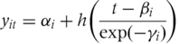

\pagenumbering{roman}  

\newpage                 

\begin{center}       

\bigskip
\bigskip
\bigskip
\bigskip
\bigskip
\bigskip
\bigskip
\bigskip


\LARGE{The growth(height) curve analysis by the SITAR model}

\bigskip
\bigskip
\bigskip
\bigskip

\large{Interim report for ST606}

\bigskip
\bigskip
\bigskip
\bigskip
\bigskip
\bigskip
\bigskip
\bigskip

\bigskip
\bigskip
\bigskip
\bigskip
\bigskip
\bigskip
\bigskip
\bigskip

\bigskip

\large{Yang Wang (19250003)}

\bigskip

\end{center}    

\newpage             

\tableofcontents

\newpage 

```{r setup, include=FALSE}
knitr::opts_chunk$set(echo = TRUE)
```

```{r echo= F}
suppressMessages(library(readxl))
suppressMessages(library(plotly))
suppressMessages(library(dplyr))
suppressMessages(library(GGally))
suppressMessages(library(ggplot2))
suppressMessages(library(sitar))
```

\pagenumbering{arabic} 

# Introduction

A growth curve is an empirical model of the evolution of a quantity over time. The growth curves are widely used in biology for quantities such as population size or biomass (in population ecology and demography, for population growth analysis), individual body height or biomass (in physiology, for growth analysis of individuals).

Growth is influenced by many factors such as heredity, genetic or congenital factors, illness and medications, nutrition, hormones, and psychosocial environment. A child growth curve is an important standard to help parents to find out whether or not their children follow a normal growth pattern. In fact, hundreds of medical issues can affect children's growth. An abnormal growth pattern is often the earliest indication of an underlying medical condition. Following a normal growth pattern is a good indicator of a child's overall good health.

The growth curve analysis is a statistical issue in life course. Height in puberty involves a growth spurt, the timing and intensity of which varies between individuals.

# Methods
I used the SuperImposition by Translation And Rotation (SITAR) model, a shape invariant model with a single fitted curve. Curves for individuals are matched to the mean curve by shifting their curve up–down (representing differences in mean size) and left–right (for differences in growth tempo), and the age scale is also shrunk or stretched to indicate how fast time passes in the individual (i.e. velocity). 
These three parameters per individual are estimated as random effects while fitting the curve. 
The outcome is a mean curve plus triplets of parameters per individual (size, tempo and velocity) that summarize the individual growth patterns.

## The SITAR model
The method used to summarize the individual growth curves.
This is a shape invariant model that involves fitting the following random effects model to the set of height growth curves.


where yit is height for subject i at age t, h(t) is a natural cubic spline curve of height vs age, 
and $\alpha$i, $\beta$i and $\gamma$i are subject-specific random effects. 
The aim is to choose the values of $\alpha$i, $\beta$i and $\gamma$i to make the individual growth curves as similar as possible.

  1. $\alpha$i is a random height intercept that adjusts for differences in mean height—here it is termed size.
  Geometrically it can be thought of as a subject-specific shift up or down or translation in the spline curve, with $\alpha$i smaller for shorter children.
  
  2. $\beta$i is a random age intercept to adjust for differences in the timing of the pubertal growth spurt in individuals, and it is here called tempo.
  Geometrically it corresponds to a subject-specific left–right shift or translation in the spline curve, with $\beta$i negative for early puberty and positive for late.
  
  3. $\gamma$i is a random age scaling that adjusts for the duration of the growth spurt in individuals. Its parameterization as exp(–$\gamma$i) ensures that both positive and negative values are permissible, with zero corresponding to average velocity, and the minus sign means that it measures velocity rather than its inverse. 
  
Geometrically it corresponds to a shrinking or stretching of the age scale. Thus for a child with a relatively short spurt and a steep growth curve, $\gamma$i is positive to stretch the age scale and reduce the slope (i.e. peak velocity). Conversely, if $\gamma$i is negative the age scale is shrunk and the curve slope increased. For this reason the parameter is termed velocity.

# The results so far

## The analysis for the datasets

The file [fit_database_anthropometric_all.xlsx] contains 102,642 records (Individuals: 14,267 (7,239 boys, and 7,028 girls)).

Each data record contains the individual ID, measurement date, age, gender,  height, weight, BMI, WHO z-score and WHO z-score categories columns. 

Deleted the 7,745 records that the heght is NA. 

Chose the datasets are heights for boy (31) and girl (38) at the stage between 2007 and 2018 (6-18 year-old), and have the complete set of 22 observations between the ages of 6 and 18 years.

```{r echo= F}
# Read data from file
dat_ex_all <- read_excel("./SharedFiles/ST606/2020/data/Exercise/fit_database_anthropometric_all.xlsx", sheet=1, na='NA')

# Clean data (delete all data that the follow conditions are NA)
dat <- subset(dat_ex_all, `height (cm)` != 'NA')

# Change the colnames
colnames(dat)[10] <- 'z_category'
colnames(dat)[9] <- 'z_score'
colnames(dat)[2] <- 'm_date'
colnames(dat)[3] <- 'age'
colnames(dat)[4] <- 'age_bin'
colnames(dat)[6] <- 'height'
colnames(dat)[7] <- 'weight'

# Change the type of ID
dat$ID = as.character(dat$ID)

# check the deleted data
dataSta <- data.frame(All = nrow(dat_ex_all), Object = nrow(dat), Deleted = nrow(dat_ex_all) - nrow(dat)) 
```

## The first dataset (Boys)

The 31 boys who have the complete set of 22 observations.

```{r echo= F}
# The boy who has the complete set of 22 observations
data_f_boys <- filter(dat, gender=="boy")
boyID <- data_f_boys %>% group_by(ID) %>% 
  summarise(nid = n())  %>% filter(nid == 22) %>% pull(ID)
data_f_boys <- filter(data_f_boys, ID %in% boyID)
##ggplot(data_f_boys, aes(x=age, y=height, color=ID))  + geom_line() + facet_wrap(~ID)
```

### Fit the models by using sitar model to find the best model

Although, the log(height)~age model is the best, however, it has convergence error.
So I chose the log(height)~log(age) model.

   model 1: height~age
   
   model 2: log(height)~age
   
   model 3: height~log(age)
   
   model 4: log(height)~log(age)

```{r echo= F}
## find the best degree freedom for boy
par(mfrow=c(1,2), cex=1.1)
bestDf <- dfset(x = age, y = height, data = data_f_boys, FUN = BIC, df = 1:10, plot = FALSE, main="height~age (Boy)")
bestDf1 <- dfset(x = age, y = log(height), data = data_f_boys, FUN = BIC, df = 1:10, plot = FALSE, main="log(height)~age (Boy)")
par(mfrow=c(1,2), cex=1.1)
bestDf2 <- dfset(x = log(age), y = height, data = data_f_boys, FUN = BIC, df = 1:10, plot = FALSE, main="height~log(age) (Boy)")
bestDf3 <- dfset(x = log(age), y = log(height), data = data_f_boys, FUN = BIC, df = 1:10, plot = FALSE, main="log(height)~log(age) (Boy)")
```

```{r echo= F}
## The growth curve for boy's height
fitHB <- sitar(x = age, y = height, id = ID, data = data_f_boys, df= bestDf[1])
#summary(fitHB)
fitHB1 <- sitar(x = age, y = log(height), id = ID, data = data_f_boys, df= bestDf1[1])
#summary(fitHB1)
fitHB2 <- sitar(x = log(age), y = height, id = ID, data = data_f_boys, df= bestDf2[1])
#summary(fitHB2)
fitHB3 <- sitar(x = log(age), y = log(height), id = ID, data = data_f_boys, df= bestDf3[1])
#summary(fitHB3)

data.frame(formula=c('height~age','log(height)~age','height~log(age)','log(height)~log(age)'), variance=c('96.56','96.47','96.45','96.41'), residual=c('1.2995116','0.00854324','1.31863340','0.008600255'), AIC=c('2718.42','-4139.344','2735.403','-4131.781'), Converge=c('True','false','True','True'))
```

### Compare the random effect ($\alpha$(a) + $\beta$(b) + $\gamma$(c))

The model with all random effects is best.

```{r echo= F}
# Random Effect by $\alpha$(a)
mba <- sitar(x=log(age), y=log(height), id=ID, data=data_f_boys, df=bestDf3[1], random = 'a')

resultA <- data.frame(Type=c('Random Effect by a'), variance=varexp(mba), residual=c('0.01741566'), AIC=c('-3424.986'), BIC=c('-3393.311'))
```

```{r echo= F}
# Random Effect by $\alpha$(a) + $\beta$(b)
mbab <- sitar(x=log(age), y=log(height), id=ID, data=data_f_boys, df=bestDf3[1], random = 'a+b')

resultB <- data.frame(Type=c('Random Effect by a + b'), variance=varexp(mbab), residual=c('0.01158098'), AIC=c('-3845.512'), BIC=c('-3800.262'))
```

```{r echo= F}
# Random Effect by $\alpha$(a) + $\beta$(b) + $\gamma$(c)
resultC <- data.frame(Type=c('Random Effect by a + b + c'), variance=varexp(fitHB3), residual=c('0.008600255'), AIC=c('-4131.781'), BIC=c('-4068.43'))
```

```{r echo= F}
resultAB <- merge(resultA, resultB, all=T)
merge(resultAB, resultC, all=T)
```

```{r echo= F}
# Growth Curve with Random Effect by $\alpha$(a) + $\beta$(b) + $\gamma$(c)
```

\newpage 

### The distance and velocity curves

Distance curve(Black solid line): the amount of height achieved at a given age.
   
Velocity curve(Blue dash line): the rate of growth at a given age.
   
```{r echo= F}
suppressMessages(plot(fitHB3, y2par=list(col='blue'), apv=TRUE))
```

1. The growth rate:

   The boys grow fast between 6~16 year-old, grow slowly after 16 year-old.
   
2. The growth velocity:
   a) It reached the peak of 9.685 at the age of 13.42.
   b) It declined slowly between 6~11 year-old.
   d) It increased rapidly between 11~13.42 year-old.
   e) It declined rapidly between 13.42~17 year-old.
   f) It is relatively constant after 17 year-old.

\newpage 

## The second dataset (Girls)

The 38 girls who have the complete set of 22 observations.
  
```{r echo= F}
# The girl who has the complete set of 22 observations
data_f_girl <- filter(dat, gender=="girl")
# The girl who has 22 records
girlID <- data_f_girl %>% group_by(ID) %>% 
  summarise(nid = n())  %>% filter(nid == 22) %>% pull(ID)
data_f_girl <- filter(data_f_girl, ID %in% girlID)

```

```{r echo= F}
data_f_girl <- data_f_girl[data_f_girl$ID != 140,]
```

### Fit the models by using sitar model to find the best model

Although, the log(height)~age model is the best, however, it has convergence error. So I chose the log(height)~log(age) model.

   model 1: height~age

   model 2: log(height)~age

   model 3: height~log(age)

   model 4: log(height)~log(age)

```{r echo= F}
## find the best degree freedom for girl
par(mfrow=c(1,2), cex=1.1)
bestDfG <- dfset(x = age, y = height, data = data_f_girl, FUN = BIC, df = 1:10, plot = FALSE, main='height~age (girl)')
bestDfG2 <- dfset(x = age, y = log(height), data = data_f_girl, FUN = BIC, df = 1:10, plot = FALSE, main='log(height)~age (girl)')

par(mfrow=c(1,2), cex=1.1)
bestDfG3 <- dfset(x = log(age), y = height, data = data_f_girl, FUN = BIC, df = 1:10, plot = FALSE, main='height~log(age) (girl)')
bestDfG4 <- dfset(x = log(age), y = log(height), data = data_f_girl, FUN = BIC, df = 1:10, plot = FALSE, main='log(height)~log(age) (girl)')
```

```{r echo= F}
## The growth curve for girl's height
fitHG <- sitar(x = age, y = height, id = ID, data = data_f_girl, df= bestDfG[1])
#summary(fitHG)

fitHG2 <- sitar(x = age, y = log(height), id = ID, data = data_f_girl, df= bestDfG2[1])
#summary(fitHG2)

fitHG3 <- sitar(x = log(age), y = height, id = ID, data = data_f_girl, df= bestDfG3[1])
#summary(fitHG3)

fitHG4 <- sitar(x = log(age), y = log(height), id = ID, data = data_f_girl, df= bestDfG4[1])
#summary(fitHG4)

data.frame(formula=c('height~age','log(height)~age','height~log(age)','log(height)~log(age)'), variance=c('96.68','96.63','96.30','96.29'), residual=c('1.0929107','0.007419857','1.10268133','0.007452629'), AIC=c('2930.909','-5201.022','2942.887','-5194.83'), Converge=c('True','False','True','True'))
```

\newpage 

### Compare the random effect ($\alpha$(a) + $\beta$(b) + $\gamma$(c))

The model with all random effects is best.

```{r echo= F}
mga <- sitar(x=log(age), y=log(height), id=ID, data=data_f_girl, df=bestDfG4[1], random = 'a')

resultA <- data.frame(Type=c('Random Effect by a'), variance=varexp(mga), residual=c('0.01423831'), AIC=c('-4416.925'), BIC=c('-4388.713'))
```

```{r echo= F}
mgab <- sitar(x=log(age), y=log(height), id=ID, data=data_f_girl, df=bestDfG4[1], random = 'a+b')

resultB <- data.frame(Type=c('Random Effect by a + b'), variance=varexp(mgab), residual=c('1.3751748'), AIC=c('3195.192'), BIC=c('3242.212'))
```

```{r echo= F}
resultC <- data.frame(Type=c('Random Effect by a + b + c'), variance=varexp(fitHG4), residual=c('0.007452629'), AIC=c('-5194.83'), BIC=c('-5133.704'))
```

```{r echo= F}
resultAB <- merge(resultA, resultB, all=T)
merge(resultAB, resultC, all=T)
```

### The distance and velocity curves

Distance curve(Black solid line): the amount of height achieved at a given age.

Velocity curve(Blue dash line): the rate of growth at a given age.

```{r echo= F}
suppressMessages(plot(fitHG4, y2par=list(col='blue'), apv=TRUE))
```

1. The growth rate:

   The girls grow fast between 6~14 year-old, grow slowly after 14 year-old.
   
2. The growth velocity:
   a) It reached the peak of 7.031 at the age of 11.19.
   b) It declined between 6~8 year-old.
   c) It increased between 8~11.19 year-old.
   d) It declined rapidly between 11.19~15 year-old.
   e) It is relatively constant after 15 year-old.

\newpage  

## Compare the growth rate and velocity of height by gender

```{r echo= F}
suppressMessages(plot(fitHB3, opt='d', col='blue', y2par=list(col='blue')))
suppressMessages(lines(fitHG4, opt='d', col='red', y2par=list(col='red')))
title("The Growth Curve (Boy:blue, Girl:red)")
```

1. 6-10 year-old: Boys and Girls almost have the same rate.

2. 10~13.5 year-old: Girls are a little higer than boys.

3. 13.6~18 year-old: Boys are significant higher than Girls.

```{r echo= F}
suppressMessages(plot(fitHB3, opt='v', col='blue', y2par=list(col='blue')))
suppressMessages(lines(fitHG4, opt='v', col='red', y2par=list(col='red')))
title("The Growth Curve : velocity (Boy:blue, Girl:red)")
```

1. 6~9 year-old: Boys and Girls are near to each other and deline.

2. 9~11 year-old: Boys and girls have different trend, Boys continue delining, Girls increase and reach the top at 11 year-old.

3. 11~15.5 year-old: Girls keep declining fast, Boys increase fast and reach the top at 13.5, then declined fast til 16.5 year-old.

4. The girls keep constant from 15.5 year-old, the boys keep constant from 17 year-old and near to each other.

## Conclusion

The fact that the model fits well both in boys and girls. 

Although, the log height scale versus age is the best model, however, the convergence error happened when fit the model, so chose the log height scale versus log age scale as the model. 

Compared the growth curve, we can see that the difference of growth rate and velocity by gender at a certain age. 

# Further work

1. Analyse the results that have done.

2. Try more transformations of model to find a better model.

3. Optimize the parameters of the SITAR model to make the curve better.

4. Focus on Analysing the fixed and random effects how to effect the model.

5. Compare the curves with the standard growth curve (WHO).  

